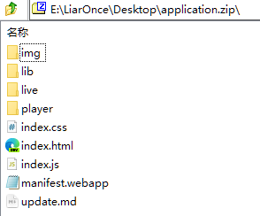
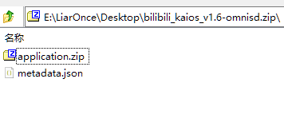

# 上架应用到商店

若想将应用上架至我们的商店，请查看以下文档：

## 打包应用

上架至商店的应用程序包应为 OmniSD 格式包，以下为 OmniSD 包的目录结构：
```text
└── (example-omnisd.zip)
    ├── application.zip
    ├── metadata.json
```
其中 `application.zip` 为应用程序包，其中必须保证 `manifest.webapp` 处于应用程序包的根目录下，以下为范例：



然后填写 `metadata.json`，并与 `application.zip` 放置在同一目录下，以下为 `metadata.json` 范例：
```json
{
    "manifestURL": "app://(appid)/manifest.webapp",
    "version": 1
}
```

### manifestURL

此值为 `manifest.webapp` 在系统中所在的路径，一般为 AppID 下，AppID 一般为 `manifest.webapp` 中的 `origin` 值。

AppID 是应用程序的域反转，例如：`app.example.com` 将是 `com.example.app`。

若没有可填写 WebIDE 自动生成的 UUID 值，但不推荐这么做，因为 UUID 值可能并不固定。

### version

此值为版本，如不清楚可以保持默认为 `1`，这并不影响后续的安装。

最终效果为：



## 填写 yml

要添加您的 app，您需要创建一个描述它的文件。该文件的名称应为 `[app id].yml` 并位于 `apps` 文件夹中，`app id` 可自行命名，但请不要使用中文。

从 [example/app.template.yml](https://github.com/openkaios/openkaios-store-db/blob/main/example/app.template.yml) 获取应用模板。

### name
应用程序的名称。

```yaml
name: Example App
```

### description
应用程序的描述，一般是一段介绍。

```yaml
description: This is just an example app, it does nothing special.
```

### icon

应用程序的图标 URL，格式允许为 `png`、`jpeg` 或 `gif`。

此 URL 不能缩短，因为它必须在末尾包含 `.png`、`.jpeg` 或 `.gif`。

```yaml
icon: https://app.example.com/icon.png
```

### screenshots (可选)

应用程序在设备上运行的一系列屏幕截图，格式允许为 `png`、`jpeg` 或 `gif`。

此 URL 不能缩短，因为它必须在末尾包含 `.png`、`.jpeg` 或 `.gif`

```yaml
screenshots:
  - https://raw.githubusercontent.com/strukturart/osm-map/master/images/image-2.png
  - https://raw.githubusercontent.com/strukturart/osm-map/master/images/image-3.png
  - https://raw.githubusercontent.com/strukturart/osm-map/master/images/image-4.png
```

### website (可选)

应用程序的网站（如果有的话）

```yaml
website: https://github.com/openkaios/chelaile
```

### git_repo (可选)

应用程序的 git 仓库地址（如果有的话）

```yaml
git_repo: https://github.com/openkaios/chelaile
```

### download
#### url

应用程序安装包 (.zip) 的下载地址（必须为 OmniSD 格式的包），且必须为可直接访问的地址（末尾为 `.zip`）

#### version

应用程序的实际版本，一般为 `manifest.webapp` 的 `version` 值。

** 注意：版本必须包含有双引号（`""`）否则将无法通过 GitHub Actions 构建**

```yaml
download:
  url: https://github.com/strukturart/rss-reader/blob/master/build/rss-reader.zip
  version: "1.0"
```

### type

应用程序类型，以下为可选值：

|type        | 描述 |
|------------|--------------------------|
|`weblink`   | 只是一个网站链接，该网站未针对 kaiOS / ffOS / GerdaROM 进行优化|
|`hosted`    | 托管应用程序（带有清单并在 KaiOS 上运行的真实应用程序）|
|`packaged`  | 类似于托管，但带有没有自动更新的 zip 文件|
|`privileged`| 与 `packaged` 相同，但运行时具有更多权限|
|`certified` | 与系统 webapps 基本相同的权限|
|`root`      | 带有最高权限的软件 (例如 `Wallace`)|

有关更多权限的信息，请参阅 [App Permissions](https://developer.kaiostech.com/docs/03.core-developer-topics/permissions)

```yaml
type: privileged
```

### license

应用程序的协议，若为开源软件，请填写开源协议，若为闭源软件或不想提供源码请填写 `Closed Source`。

尽管您可以填写 `Unknown` 作为应用程序的许可证，但强烈建议您为您的应用程序选择许可证，最好是 FOSS 许可证。

**为什么？** 因为如果您不这样做，将根据 **《伯尔尼公约》**([百度百科](https://baike.baidu.com/item/%E4%BF%9D%E6%8A%A4%E6%96%87%E5%AD%A6%E5%92%8C%E8%89%BA%E6%9C%AF%E4%BD%9C%E5%93%81%E4%BC%AF%E5%B0%94%E5%B0%BC%E5%85%AC%E7%BA%A6/5195457) [Wikipedia](https://en.wikipedia.org/wiki/Berne_Convention))，您的应用程序将默认认定为封闭源代码和专有的，其他人无法重新分发或更改源代码 **即使您在GitHub 或 GitLab或其他任何地方发布了源代码**。

**中国为《伯尔尼公约》成员国，且具有法律效力。**

```yaml
license: MIT
```

### author

应用程序的作者，值允许为个人、团体、组织、公司。

```yaml
author: LiarOnce <liaronce@hotmail.com>
```

### maintainer

应用程序的维护者，值允许为个人、团体或组织，在大多数情况下与 `author` 相同，但允许为多人或多个组织。

```yaml
maintainer: 
  - LiarOnce <liaronce@hotmail.com>
  - openKaiOS
```

### donation (可选)

应用程序的捐赠地址（如果有的话）

```yaml
donation: 
```

### has_ads

应用程序是否有广告（请务必如实填写）

可选值为：`true`、`false`

```yaml
has_ads: false
```

### has_tracking

应用程序是否跟踪用户以评估数据（请务必如实填写）

可选值为：`true`、`false`

```yaml
has_tracking: false
```

### meta

#### tags

应用程序的标签，若有多个标签，可使用 `;` 隔开。

#### categories

应用程序的分类，目前可选值如下（如需新增分类请发起 issue）。

目前可选值：

|      值       |  描述  |
| :-----------: | :----: |
| communication |  通讯  |
|   education   |  教育  |
|     games     |  游戏  |
|    health     |  健康  |
|  multimedia   | 多媒体 |
|     news      |  新闻  |
|    search     |  搜索  |
|    social     |  社交  |
|    travel     |  旅游  |
|    utility    |  工具  |


```yaml
meta:
  tags: bilibili
  categories:
    - multimedia
```

## 提交 yml

Fork [本仓库](https://github.com/openkaios/openkaios-store-db)，将你所填写的 `[app id].yml` 上传至 `apps` 文件夹。

最后在本项目发起 Pull Request，我们将对应用进行审核，通过后将会立即上架或在第二天 6:00 （北京时间）上架（GitHub Actions 定时构建）